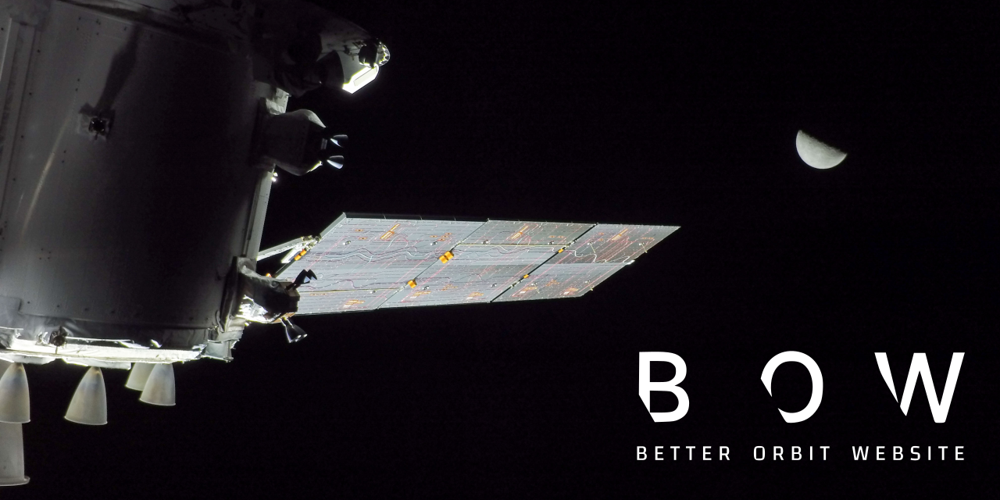

<<<<<<< HEAD
# React + Vite

This template provides a minimal setup to get React working in Vite with HMR and some ESLint rules.

Currently, two official plugins are available:

- [@vitejs/plugin-react](https://github.com/vitejs/vite-plugin-react/blob/main/packages/plugin-react) uses [Oxc](https://oxc.rs)
- [@vitejs/plugin-react-swc](https://github.com/vitejs/vite-plugin-react/blob/main/packages/plugin-react-swc) uses [SWC](https://swc.rs/)

## React Compiler

The React Compiler is not enabled on this template because of its impact on dev & build performances. To add it, see [this documentation](https://react.dev/learn/react-compiler/installation).

## Expanding the ESLint configuration

If you are developing a production application, we recommend using TypeScript with type-aware lint rules enabled. Check out the [TS template](https://github.com/vitejs/vite/tree/main/packages/create-vite/template-react-ts) for information on how to integrate TypeScript and [`typescript-eslint`](https://typescript-eslint.io) in your project.
=======

  <!-- Banner goes here -->
  

**Better Orbit Website**, or **BOW** for short, is an alternative to NASA's Unity WebGL-based **Artemis Real-time Orbit Website (AROW)**.

My goal from this project was to build a cleaner, modern, and fully open-source orbit visualization experience using **Three.js**, while pulling data directly from the same API endpoints used by AROW so the information stays accurate.

This started as a personal practice project to learn Three.js, but it ended up being a lot of the hard work around data collection, reverse engineering, asset extraction, and several more skills that it helped me develop.
>>>>>>> cce69d52d6f8a9e5ecfe3c028b7e0a0586629062
